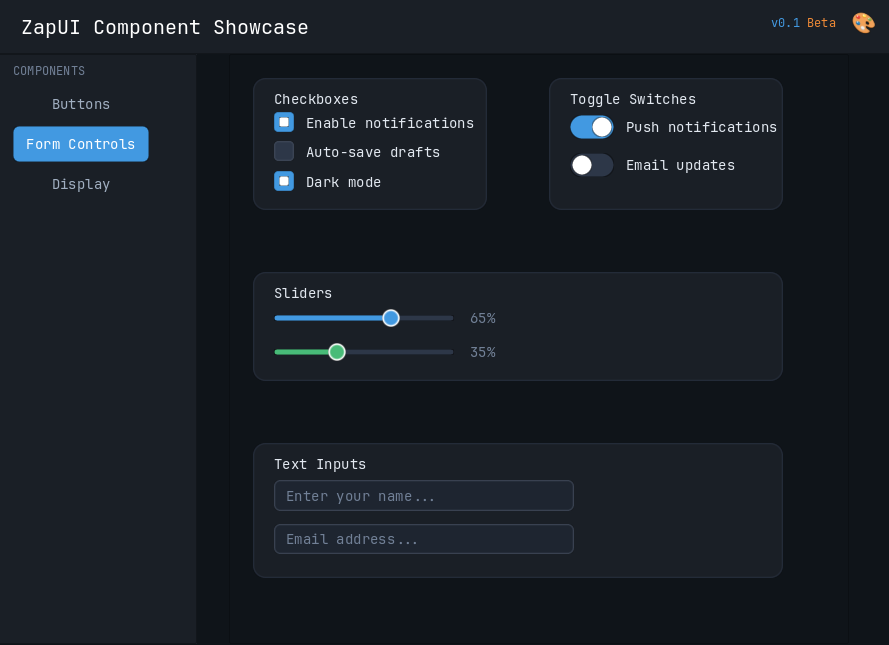

# zapui

A Zig UI framework inspired by [Zed's GPUI](https://github.com/zed-industries/zed/tree/main/crates/gpui).

## License

This project is licensed under the **Apache License 2.0** - see the [LICENSE](LICENSE) file for details.

### Attribution

This project takes direct inspiration from [GPUI](https://github.com/zed-industries/zed/tree/main/crates/gpui), the UI framework developed by [Zed Industries](https://zed.dev/) for the Zed editor.

The layout engine is a Zig port of [Taffy](https://github.com/DioxusLabs/taffy), licensed under MIT. See [src/taffy/LICENSE](src/taffy/LICENSE) for details.
